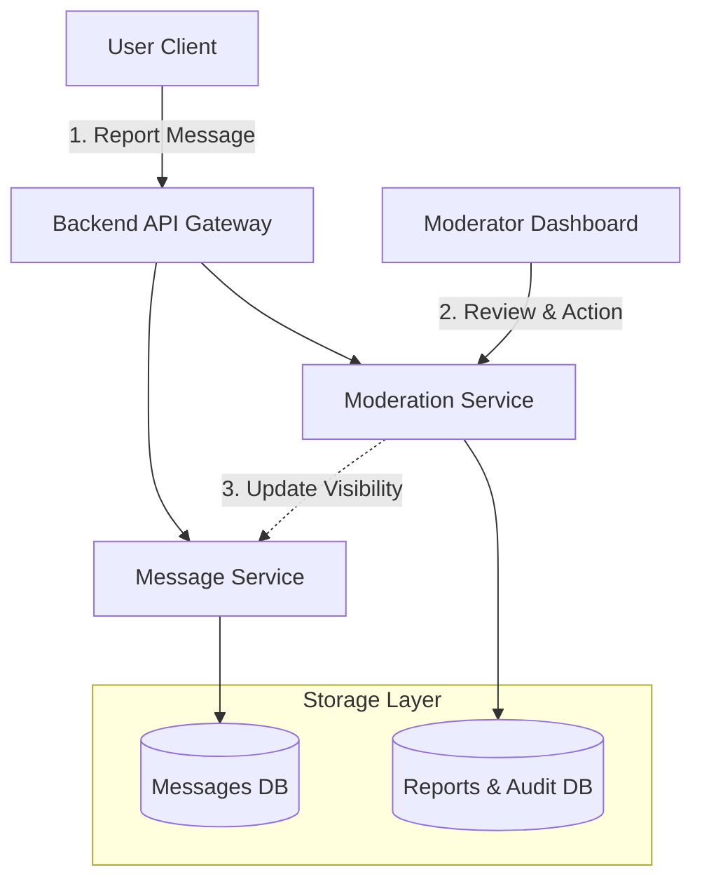
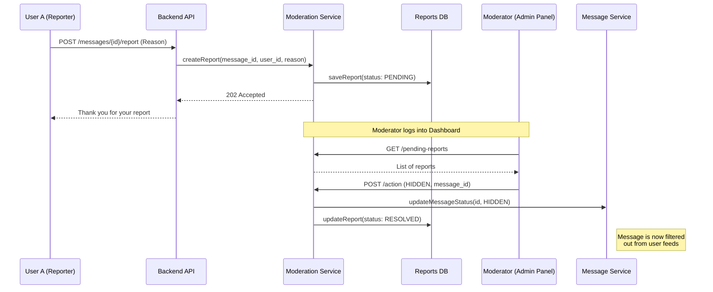
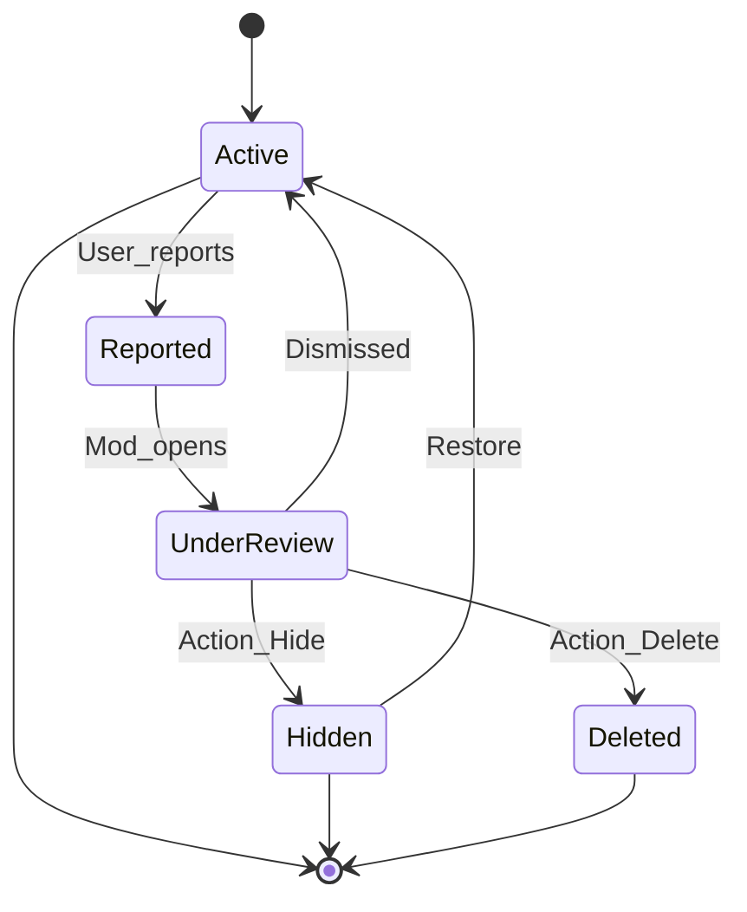

# 🧪 Laboratory Work 1: Messaging System Design
**Варіант 10: Moderation & Reporting** **Виконав:** Яценко Микола Васильович  
**Група:** Б-121-24-3 ПІ  

---

## 🎯 Мета роботи
- Проектування архітектури системи повідомлень перед початком розробки.
- Розподіл відповідальності між компонентами.
- Використання діаграм Component, Sequence та State для візуалізації логіки.
- Документування архітектурних рішень (ADR).

---

## 🧠 Контекст
Проектування месенджера з фокусом на **модерацію контенту**. Система дозволяє користувачам надсилати скарги на повідомлення, а модераторам — оперативно перевіряти їх та приховувати порушення.

---

## 🧱 Частина 1 — Component Diagram
Ця діаграма відображає структуру системи. Ми виділяємо окремий сервіс модерації, щоб не перевантажувати основний сервіс повідомлень адміністративною логікою.


🔁 Частина 2 — Sequence Diagram
Сценарій: Користувач А надсилає скаргу на повідомлення. Модератор отримує сповіщення, перевіряє контент і приховує його.

🔄 Частина 3 — State Diagram
Опис життєвого циклу повідомлення в контексті модерації. Повідомлення може бути активним, під перевіркою або прихованим/видаленим.

📚 Частина 4 — Architecture Decision Record (ADR)
ADR-010: Використання "Soft Delete" та статусів видимості для модерації
```markdown
Status
Accepted

Context
Коли модератор вирішує, що повідомлення порушує правила спільноти, нам потрібно вибрати: видаляти дані фізично чи просто приховувати їх. Система повинна підтримувати прозорість, можливість апеляцій та зберігати історію дій модераторів.

Decision
Впровадити механізм Soft Delete (м'яке видалення) через поле visibility_status у базі даних повідомлень.

Повідомлення, позначені модератором, отримують статус HIDDEN_BY_MODERATOR.

Сервіс повідомлень (Message Service) автоматично фільтрує повідомлення, де статус не є ACTIVE, для звичайних запитів користувачів.

Окремий Audit Log ведеться в Moderation Service для запису того, який модератор виконав дію та з якої причини.

Consequences
Висока цілісність даних: Контент залишається доступним для апеляцій або запитів правоохоронних органів.

Можливість скасування: Модератори можуть легко повернути повідомлення, якщо сталася помилка.

Підзвітність: Кожна адміністративна дія зафіксована.

Навантаження на сховище: "Видалені" повідомлення продовжують займати місце в основній базі.

Продуктивність: Кожен запит на читання має фільтрувати статус (потрібен індекс на visibility_status).
```
